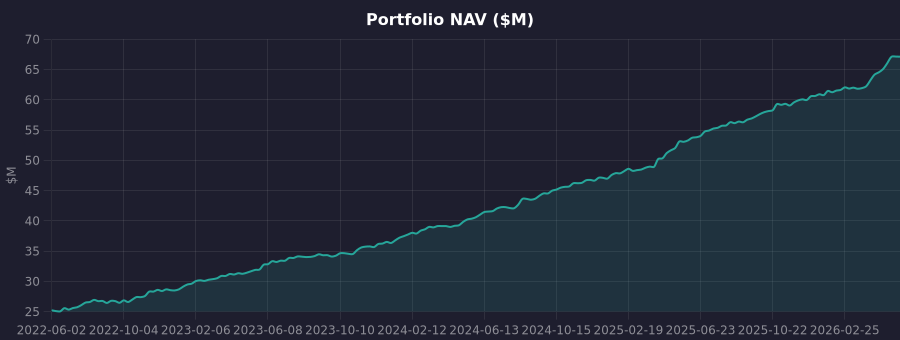
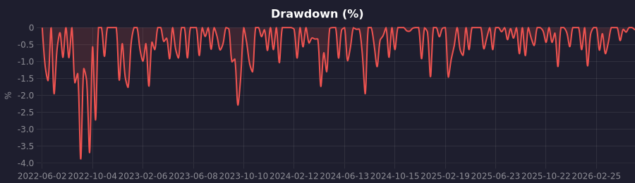
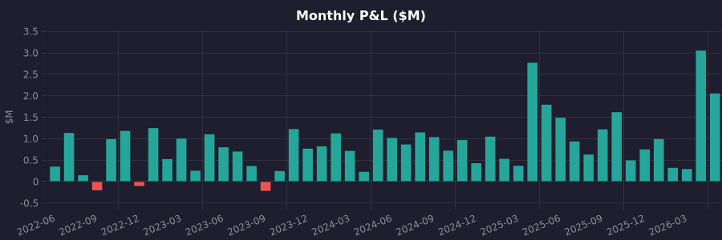

# MU SSA Quant

**Institutional-grade multi-broker quantitative trading platform.**

A fully integrated quantitative investment platform — from AI-driven strategy research and real-time risk monitoring to automated multi-broker execution. Built for professional asset managers and institutional teams seeking systematic, disciplined portfolio management.

[:material-book-open-variant: Strategy Development Guide](strategy-guide.md){ .md-button .md-button--primary }

---

## Live Performance

  
$67.1MPortfolio AUM

  
168.4%Total Return

  
28.2%Annualized Return

  
26.8%YTD Return (2026)

  
-3.9%Max Drawdown

  
4.78Sharpe Ratio

| Metric | Value |
|--------|-------|
| Initial Capital | $25,000,000 |
| Current NAV | $67,113,900 |
| Total P&L | +$42,109,941 |
| Annualized Return | 28.2% |
| YTD Return (2026) | 26.8% |
| Max Drawdown | -3.9% |
| Sharpe Ratio | 4.78 |
| Sortino Ratio | 6.93 |
| Win Rate | 60.4% |
| Active Strategies | 5 strategies across multiple accounts |
| Connected Brokers | 5 broker accounts (Tiger, IBKR) |
| Track Record | June 2022 – Present (4 years) |

### Equity Curve (NAV, $M)

### Drawdown (%)

### Monthly P&L ($M)

---

## Intelligent Risk Control

The platform features a built-in multi-factor risk control system that continuously monitors market conditions and automatically adjusts portfolio exposure to avoid major downturns.

!!! info "How It Works"

    The risk engine monitors the following key market indicators in real time:

    | Indicator | What It Monitors |
    |-----------|-----------------|
    | **VIX** | Equity market fear and implied volatility |
    | **MOVE Index** | Bond market volatility |
    | **High-Yield Spread** | Credit market stress signals |
    | **SKEW** | Tail risk and black swan expectations |
    | **Market Breadth** | How broadly stocks are participating in rallies |

    When these indicators signal rising risk, the system automatically reduces equity exposure and shifts into defensive positions. When conditions normalize, it gradually restores full allocation.

!!! success "Backtested Across 50 Years of Market Data"

    The risk control model has been validated against over 50 years of US market history, covering every major crash — including the 1973-74 bear market, 1987 Black Monday, the 2000 dot-com bust, the 2008 financial crisis, and the 2020 COVID crash. In each case, the system successfully reduced exposure before the worst drawdowns occurred.

---

## Strategy Solutions

Seven professionally managed strategies, each designed for specific market conditions and investment objectives.

!!! note "Momentum Breakout"

    **Timeframe**: Intraday (5-min / 15-min) &nbsp;|&nbsp; **Market**: US Large-Cap Equities

    Captures short-term price momentum in highly liquid US stocks. Designed for active intraday alpha generation with systematic entry and exit rules.

    **Best For**: Investors seeking short-term trading returns in liquid markets

    | Advantage | Limitation |
    |-----------|------------|
    | High liquidity — trades only the most liquid names | Requires active market monitoring |
    | Systematic rules eliminate emotional decision-making | Intraday only — does not capture longer-term trends |
    | Built-in risk controls on every trade | Performance depends on market volatility |

!!! note "Large-Cap Portfolio Optimization"

    **Timeframe**: Monthly rebalancing &nbsp;|&nbsp; **Market**: 28 US Large-Cap Stocks

    Systematically selects the strongest-performing large-cap stocks each month. The strategy dynamically adjusts portfolio exposure based on real-time macro risk conditions, with automatic protective measures during market stress.

    **Best For**: Long-term investors seeking systematic equity allocation with built-in downside protection

    | Advantage | Limitation |
    |-----------|------------|
    | Monthly rebalancing — low maintenance | Equity-only — no fixed income or alternatives |
    | Automatic risk reduction during market stress | Monthly granularity may miss short-term opportunities |
    | Diversified across 28+ blue-chip names | Performance tied to US large-cap market |

!!! note "Risk-Off Rotation"

    **Timeframe**: Daily monitoring &nbsp;|&nbsp; **Market**: US Equities + Bonds + Gold

    Automatically shifts between growth assets and defensive assets (bonds, gold) based on market regime detection. Only trades when the market environment changes, minimizing unnecessary turnover.

    **Best For**: Balanced portfolios seeking downside protection without manual intervention

    | Advantage | Limitation |
    |-----------|------------|
    | Automatic defensive rotation during downturns | May lag in rapid regime transitions |
    | Very low turnover — trades only on regime changes | Defensive assets may underperform in strong bull markets |
    | Combines equity growth with bond/gold safety | Relies on regime detection accuracy |

!!! note "Market Risk Score Engine"

    **Timeframe**: Continuous (updated every 4 hours) &nbsp;|&nbsp; **Scope**: Global Macro

    A multi-factor risk assessment engine that continuously evaluates market conditions across equity volatility, credit stress, bond market risk, tail risk, and market breadth. Feeds recommended exposure levels into all other strategies for dynamic position sizing.

    **Best For**: Risk-conscious investors who want systematic, data-driven exposure management

    | Advantage | Limitation |
    |-----------|------------|
    | Objective, multi-factor risk assessment | Assessment-only — does not directly generate trades |
    | Automatic exposure scaling across all strategies | Macro factors may not capture sector-specific risks |
    | Proven track record through multiple market regimes | 4-hour update frequency may miss intraday shocks |

!!! tip "Market Depth Defense"

    **Target**: Low-float, small-cap stocks &nbsp;|&nbsp; **Data**: Real-time Level 2 Order Book

    Protects positions in low-liquidity stocks by continuously monitoring order book depth and detecting abnormal selling pressure. Automatically deploys defensive support at key price levels when hostile activity is detected.

    **Best For**: Investors with significant positions in low-float stocks who need protection against price manipulation

    | Advantage | Limitation |
    |-----------|------------|
    | Real-time order book monitoring and response | Only effective for supported exchanges |
    | Automatic defensive deployment — no manual intervention | Requires Level 2 market data subscription |
    | Anti-predatory measures with randomized execution | Designed for low-float securities specifically |

!!! note "Liquidity Provision (Market Making)"

    **Timeframe**: Continuous intraday &nbsp;|&nbsp; **Market**: Low-liquidity equities and ETFs

    Provides two-sided liquidity to underserved securities by placing competitive bid and ask quotes. Leverages multi-account isolation to maintain independent quoting across different instruments, improving fill rates and spread capture. Designed for securities where natural liquidity is thin and institutional participation is limited.

    **Best For**: Firms seeking to earn spread income by servicing liquidity-starved markets

    | Advantage | Limitation |
    |-----------|------------|
    | Earns bid-ask spread on every completed round trip | Commission and fee drag reduces net profitability |
    | Multi-account isolation prevents cross-instrument interference | Requires deep understanding of target security microstructure |
    | Systematic quoting removes human latency | Inventory risk during rapid directional moves |
    | Serves a market function by improving price discovery | Effectiveness depends on sufficient trading volume |

!!! note "Intraday Volatility Capture"

    **Timeframe**: Intraday (1-min / 5-min) &nbsp;|&nbsp; **Market**: High-volatility equities

    Systematically identifies and captures natural intraday price oscillations in volatile securities. Uses statistical mean-reversion signals to enter positions when prices deviate from short-term equilibrium, and exits when prices revert. All trades are closed before market close — no overnight exposure.

    **Best For**: Investors targeting consistent intraday returns from securities with wide daily price ranges

    | Advantage | Limitation |
    |-----------|------------|
    | Profits from natural price oscillations without directional bias | Requires securities with sufficient intraday range |
    | No overnight risk — all positions closed by end of day | High trade frequency increases commission costs |
    | Statistical edge from mean-reversion tends to be persistent | Performance depends on realized volatility levels |
    | Works in both up and down markets | Not suitable for low-volatility or illiquid securities |

---

## AI-Powered Research

Our integrated AI research engine accelerates strategy development from weeks to hours.

!!! abstract "AI Quant Assistant"

    - **Natural Language Strategy Creation** — Describe your strategy idea in plain language, and the AI generates validated, backtest-ready strategy code
    - **Hypothesis Testing** — AI systematically generates, tests, and validates trading hypotheses using walk-forward analysis
    - **Overfitting Detection** — Built-in statistical tests measure overfitting probability before any strategy goes live
    - **Continuous Learning** — The research agent monitors live strategy performance and suggests parameter adjustments based on changing market conditions

    **Recent AI Research Results**:

    | Hypothesis | Status | In-Sample Sharpe | Out-of-Sample Sharpe | Overfit Probability |
    |-----------|--------|-----------------|---------------------|---------------------|
    | Momentum factor outperforms in low-VIX regimes | Validated | 2.14 | 1.68 | 21% |
    | Mean-reversion strengthens when yield spread widens | Validated | 1.89 | 1.42 | 28% |
    | Volume-confirmed RSI reversal improves risk-adjusted returns | Testing | 1.56 | — | — |

---

## Intelligent Order Execution

Production-grade execution algorithms designed to minimize market impact when trading large positions.

| Capability | What It Does |
|-----------|--------------|
| **Time-Weighted Execution (TWAP)** | Spreads large orders evenly across a time window, reducing timing risk |
| **Volume-Weighted Execution (VWAP)** | Matches the natural market volume pattern to minimize price impact |
| **Iceberg Orders** | Hides true order size, revealing only small portions at a time to prevent information leakage |

All orders pass through 11 independent risk checks before execution — including position limits, loss limits, price deviation protection, and circuit breakers.

---

## Multi-Broker Support

Seamlessly trade across multiple brokers and markets from a single platform.

<table>
<thead><tr><th>Broker</th><th>Markets</th><th>Status</th></tr></thead>
<tbody>
<tr><td>Interactive Brokers (IBKR)</td><td>US Equities</td><td>Live</td></tr>
<tr><td>Tiger Trade</td><td>US / HK Equities</td><td>Live</td></tr>
<tr><td>Binance Spot</td><td>Crypto Spot</td><td>Live</td></tr>
<tr><td>Binance Futures</td><td>Crypto Futures (USDT-M)</td><td>Live</td></tr>
<tr><td>Futu (Moomoo)</td><td>US / HK / A-Share</td><td>Testing</td></tr>
<tr><td>Longbridge</td><td>US / HK / SG Equities</td><td>Testing</td></tr>
<tr><td>OKX</td><td>Crypto Spot + Futures</td><td>Testing</td></tr>
<tr><td>Bybit</td><td>Crypto Derivatives</td><td>Testing</td></tr>
<tr><td>Alpaca</td><td>US Equities</td><td>Grayscale Launch</td></tr>
<tr><td>Webull</td><td>US Equities</td><td>Grayscale Launch</td></tr>
<tr><td>Charles Schwab</td><td>US Equities + Options</td><td>Grayscale Launch</td></tr>
<tr><td>TradeStation</td><td>US Equities + Futures</td><td>Grayscale Launch</td></tr>
<tr><td>Tradier</td><td>US Equities + Options</td><td>Grayscale Launch</td></tr>
<tr><td>E*TRADE (Morgan Stanley)</td><td>US Equities + Options</td><td>Grayscale Launch</td></tr>
<tr><td>Paper Trading</td><td>All Markets</td><td>Live</td></tr>
</tbody>
</table>

**Account Isolation** — Each broker account operates in its own isolated environment with a dedicated network identity. This ensures complete separation between accounts and prevents cross-account interference.

---

## Why MU SSA Quant

- **Institutional Infrastructure** — The same technology stack used by professional trading firms, made accessible through an intuitive web interface
- **AI-Driven Research** — Move from idea to validated strategy in hours, not weeks
- **Always-On Risk Management** — 11 risk rules checked on every order, macro risk monitored 24/7, automatic circuit breakers
- **Multi-Broker Flexibility** — Trade US equities, Hong Kong equities, and crypto from one platform
- **Complete Transparency** — Real-time dashboards for portfolio performance, risk metrics, trade journal, and signal audit trail

---

*Ready to get started? Explore the [Strategy Development Guide](strategy-guide.md).*
